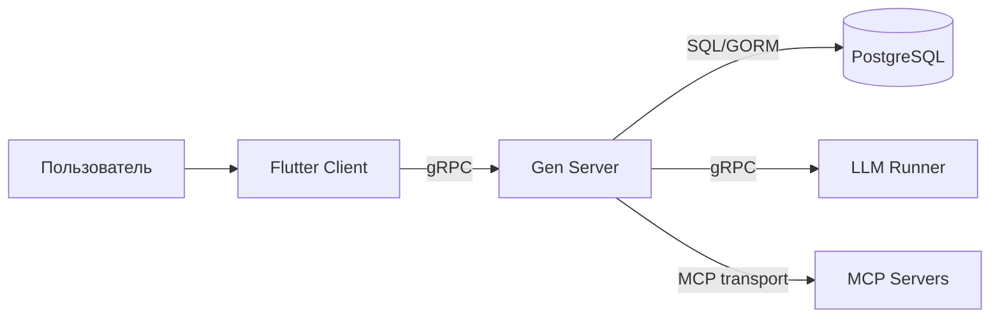

# Архитектура платформы Gen

## 1. Назначение проекта

`Gen` - платформа для работы с LLM, состоящая из нескольких независимых компонентов:

- backend-сервер (`gen-server`) для бизнес-логики и оркестрации;
- клиентское приложение (Flutter) для взаимодействия пользователя с системой;
- отдельный LLM runner (`gen-llm-runner`) для инференса моделей;
- набор MCP-серверов для подключения внешних инструментов и источников данных.

## 2. Высокоуровневая схема

## 3. Структура репозитория

Основной код находится в каталоге `gen`:

- `cmd/` - точки входа приложений:
  - `cmd/gen/main.go` - запуск backend-сервера;
  - `cmd/gen-llm-runner/main.go` - запуск runner CLI/сервиса.
- `internal/` - backend по слоям:
  - `internal/delivery/handler/` - gRPC-обработчики;
  - `internal/usecase/` - сценарии бизнес-логики;
  - `internal/service/` - сервисный слой (JWT, runner-клиент и др.);
  - `internal/repository/postgres/` - доступ к данным;
  - `internal/domain/` - доменные модели и контракты;
  - `internal/app/di/` - сборка зависимостей и wiring.
- `api/proto/` - gRPC/Protobuf контракты:
  - `api/proto/app/*.proto` - API платформы;
  - `api/proto/llm-runner/llmrunner.proto` - API runner.
- `llm-runner/` - реализация runtime для LLM-инференса.
- `client-app/` - Flutter-клиент.
- `mcp-servers/` - отдельные MCP-сервисы.
- `configs/` - конфиги (`config.yaml`, `config-llm-runner.yaml`).
- `migrations/` - SQL-миграции PostgreSQL.
- `docs/` - техническая документация.

## 4. Backend-архитектура (слои)

Backend построен по layered/clean-подходу:

1. **Delivery (gRPC handlers)**  
   Принимает входящие gRPC-запросы, валидирует/нормализует входные данные и вызывает usecase-слой.

2. **UseCase (бизнес-сценарии)**  
   Содержит логику чатов, сообщений, авторизации, работы с файлами, запусков инструментов и взаимодействия с LLM.

3. **Service (интеграции)**  
   Изолирует внешние взаимодействия: JWT, runner gRPC-клиент, вспомогательные оркестрационные сервисы.

4. **Repository (PostgreSQL/GORM)**  
   Инкапсулирует SQL/ORM-доступ к таблицам и скрывает детали хранения от бизнес-логики.

5. **Domain**  
   Базовые сущности, контракты репозиториев и типы, на которые опираются верхние слои.

6. **DI Container**  
   В `internal/app/di/container.go` собираются провайдеры БД, репозитории, сервисы, usecase и gRPC-сервер.

## 5. Основные компоненты и ответственность

### 5.1 Gen Server

`cmd/gen/main.go` выполняет:

- загрузку конфигурации;
- инициализацию подключений (БД и внешние зависимости);
- сборку контейнера зависимостей;
- регистрацию gRPC-сервисов (Auth/Chat/Editor/User/Runner);
- запуск gRPC-сервера и graceful shutdown.

### 5.2 LLM Runner

Runner - отдельный процесс/сервис, который:

- загружает модель(и) и параметры инференса;
- предоставляет gRPC-интерфейс для генерации/стриминга ответов;
- может работать на выделенных узлах (CPU/GPU) и масштабироваться независимо.

Backend взаимодействует с runner через внутренний сервисный слой (gRPC client).

### 5.3 Flutter Client

Клиентское приложение:

- предоставляет UI чата и управления настройками;
- обращается к backend по gRPC;
- не содержит backend-логики и может разворачиваться независимо.

### 5.4 MCP Servers

MCP-серверы подключают внешние системы и инструменты.  
Backend управляет политиками использования и вызывает инструменты в агентных сценариях через MCP-клиенты.

## 6. Потоки выполнения

### 6.1 Startup backend

1. Чтение `configs/config.yaml`.
2. Подключение к PostgreSQL.
3. Применение/проверка миграций.
4. Сборка DI-контейнера.
5. Регистрация gRPC handlers.
6. Запуск сервера и ожидание сигналов остановки.

### 6.2 Запрос чата

1. Клиент вызывает `Chat` API по gRPC.
2. Handler передает управление в `ChatUseCase`.
3. UseCase читает/пишет состояние чата в PostgreSQL через repository.
4. При необходимости вызывает LLM runner.
5. При необходимости выполняет MCP-инструменты и обрабатывает их результат.
6. Возвращает итоговый ответ (в том числе в стриминговом режиме, если поддерживается методом).

## 7. Модель данных

Схема задается миграциями в `migrations/`, ключевые сущности:

- пользователи и аутентификация (`users`);
- раннеры и их конфигурация (`runners`);
- чаты и сообщения (`chats`, `messages`);
- файлы/вложения и RAG-индексы (`files`, `document_rag_chunks`);
- настройки и интеграции инструментов, включая MCP (`mcp_servers` и связанные таблицы).

## 8. Конфигурация и безопасность

### 8.1 Конфигурация

- Backend: `configs/config.yaml`.
- Runner: `configs/config-llm-runner.yaml`.
- Конфиг включает параметры сети, БД, JWT, лимиты и поведение интеграций.

### 8.2 Безопасность

- JWT-аутентификация для пользовательских API.
- Ограничения на выполнение инструментов и политики MCP (allowlist/transport policy).
- Практики graceful shutdown и контроль таймаутов соединений на уровне сервисов.

## 9. Инфраструктура и эксплуатация

- Локальная разработка и сборка: `Makefile` (`make build`, `make run`, `make run-cpu`, `make run-gpu`).
- Контейнеризация: `Dockerfile`, `docker-compose.yaml`.
- CI/CD: workflow-файлы в `.github/workflows/` (CI, build, release).

## 10. Принципы масштабирования

Проект масштабируется горизонтально по компонентам:

- backend-сервер масштабируется независимо как stateless gRPC слой;
- LLM runner масштабируется отдельно (добавление новых узлов/моделей);
- БД масштабируется стандартными PostgreSQL-подходами;
- MCP-серверы добавляются модульно без изменения ядра backend.
